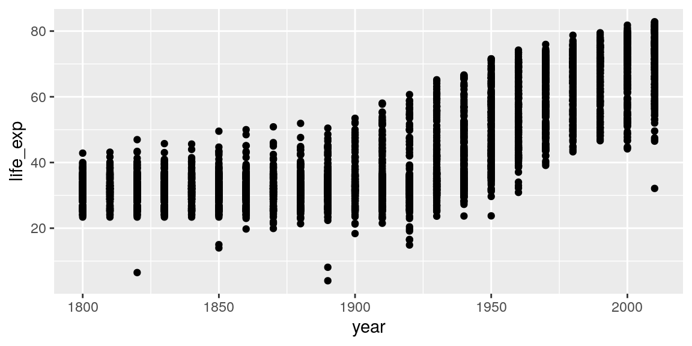
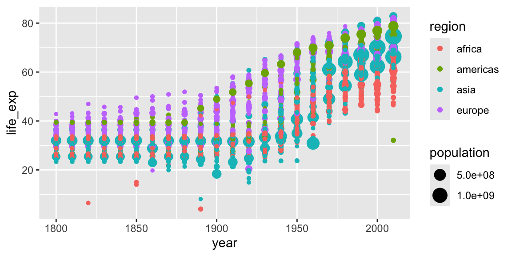
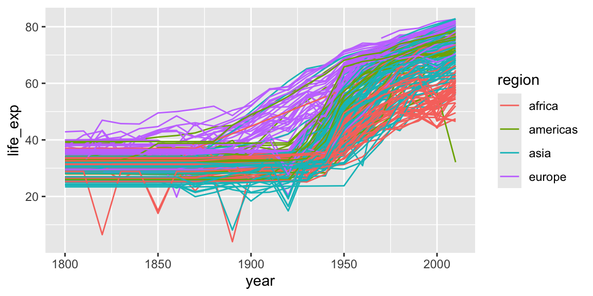
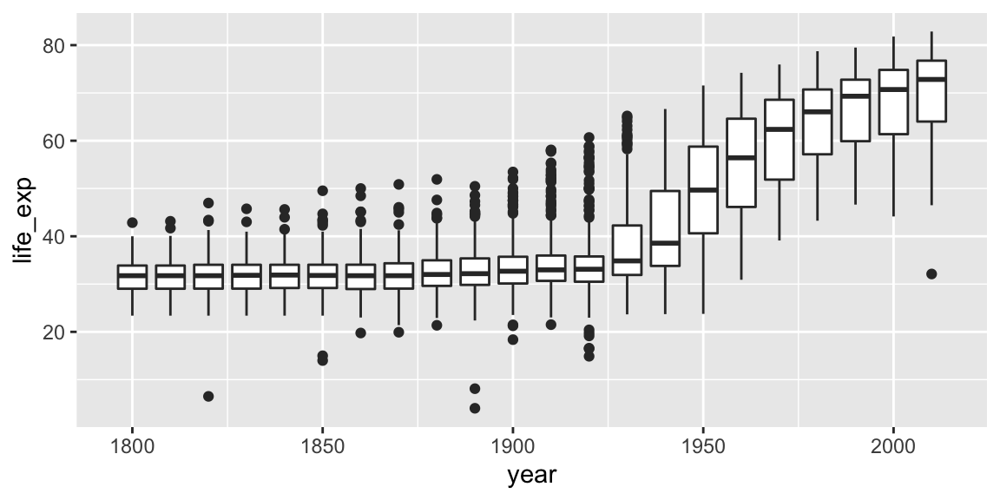
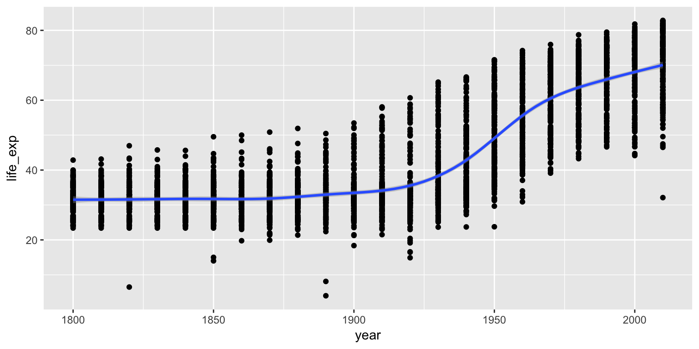
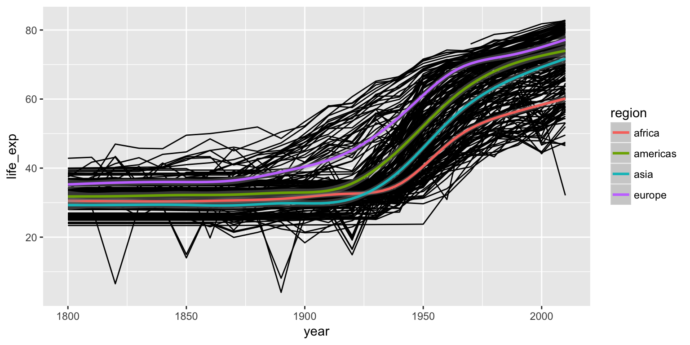
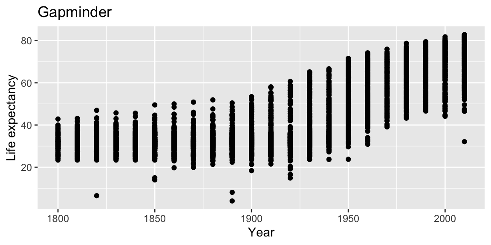
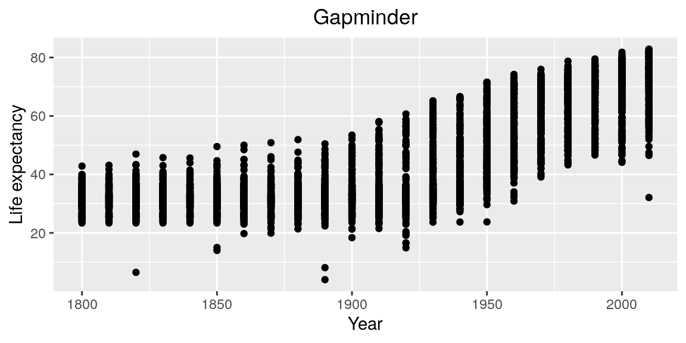
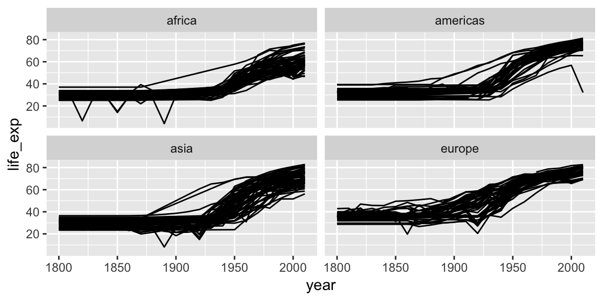

# Plotting with ggplot2


We already saw some of R's built in plotting facilities with the function `plot`. A more recent and much more powerful plotting library is `ggplot2`. `ggplot2` is another mini-language within R, a language for creating plots. It implements ideas from a book called ["The Grammar of Graphics"](https://www.amazon.com/Grammar-Graphics-Statistics-Computing/dp/0387245448). The syntax can be a little strange, but there are plenty of examples in the [online documentation](http://ggplot2.tidyverse.org/reference/).

`ggplot2` is part of the Tidyverse, so loading the `tidyverse` package will load `ggplot2`.


```r
library(tidyverse)
```

We continue with the Gapminder dataset, which we loaded with:


```r
geo <- read_csv("r-intro-2-files/geo.csv")
gap <- read_csv("r-intro-2-files/gap-minder.csv")
gap_geo <- left_join(gap, geo, by="name")
```

## Elements of a ggplot

Producing a plot with `ggplot2`, we must give three things:

1. A data frame containing our data.
2. How the columns of the data frame can be translated into positions, colors, sizes, and shapes of graphical elements ("aesthetics").
3. The actual graphical elements to display ("geometric objects").


Let's make our first ggplot.


```r
ggplot(gap_geo, aes(x=year, y=life_exp)) +
    geom_point()
```




The call to `ggplot` and `aes` sets up the basics of how we are going to represent the various columns of the data frame. `aes` defines the "aesthetics", which is how columns of the data frame map to graphical attributes such as x and y position, color, size, etc. `aes` is another example of magic "non-standard evaluation", arguments to `aes` may refer to columns of the data frame directly. We then literally add layers of graphics ("geoms") to this.

Further aesthetics can be used. Any aesthetic can be either numeric or categorical, an appropriate scale will be used.


```r
ggplot(gap_geo, aes(x=year, y=life_exp, color=region, size=population)) +
    geom_point()
```



### Challenge: make a ggplot {.challenge}

This R code will get the data from the year 2010:


```r
gap2010 <- filter(gap_geo, year == 2010)
```

Create a ggplot of this with:

* `gdp_percap` as x. 
* `life_exp` as y.
* `population` as the size.
* `region` as the color.


## Further geoms

To draw lines, we need to use a "group" aesthetic.


```r
ggplot(gap_geo, aes(x=year, y=life_exp, group=name, color=region)) +
    geom_line()
```



A wide variety of geoms are available. Here we show Tukey box-plots. Note again the use of the "group" aesthetic, without this ggplot will just show one big box-plot.


```r
ggplot(gap_geo, aes(x=year, y=life_exp, group=year)) +
    geom_boxplot()
```



`geom_smooth` can be used to show trends.


```r
ggplot(gap_geo, aes(x=year, y=life_exp)) +
    geom_point() +
    geom_smooth()
```

```
## `geom_smooth()` using method = 'gam' and formula 'y ~ s(x, bs = "cs")'
```



Aesthetics can be specified globally in `ggplot`, or as the first argument to individual geoms. Here, the "group" is applied only to draw the lines, and "color" is used to produce multiple trend lines:


```r
ggplot(gap_geo, aes(x=year, y=life_exp)) +
    geom_line(aes(group=name)) +
    geom_smooth(aes(color=oecd))
```

```
## `geom_smooth()` using method = 'gam' and formula 'y ~ s(x, bs = "cs")'
```



## Highlighting subsets

Geoms can be added that use a different data frame, using the `data=` argument.


```r
gap_australia <- filter(gap_geo, name == "Australia")

ggplot(gap_geo, aes(x=year, y=life_exp, group=name)) +
    geom_line() +
    geom_line(data=gap_australia, color="red", size=2)
```


Notice also that the second `geom_line` has some further arguments controlling its appearance. These are **not** aesthetics, they are not a mapping of data to appearance, but rather a direct specification of the appearance. There isn't an associated scale as when color was an aesthetic.


## Fine-tuning a plot

Adding `labs` to a ggplot adjusts the labels given to the axes and legends. A plot title can also be specified.


```r
ggplot(gap_geo, aes(x=year, y=life_exp)) +
    geom_point() +
    labs(x="Year", y="Life expectancy", title="Gapminder")
```




Now, the figure has proper labels and titles. However, the title is not at the center of the figure.
We can further customize it using `theme()` function (for more detail please see the docs `?theme`).


```r
ggplot(gap_geo, aes(x=year, y=life_exp)) +
    geom_point() +
    labs(x="Year", y="Life expectancy", title="Gapminder") +
    theme(plot.title = element_text(hjust = 0.5))
```



Now figure looks better.


`coord_cartesian` can be used to set the limits of the x and y axes. Suppose we want our y-axis to start at zero.


```r
ggplot(gap_geo, aes(x=year, y=life_exp)) +
    geom_point() +
    coord_cartesian(ylim=c(0,90))
```



Type `scale_` and press the tab key. You will see functions giving fine-grained controls over various scales (x, y, color, etc). These allow transformations (eg log10), and manually specified breaks (labelled values). Very fine grained control is possible over the appearance of ggplots, see the ggplot2 documentation for details and further examples.


### Challenge: refine your ggplot {.challenge}

Continuing with your scatter-plot of the 2010 data, add axis labels to your plot.

Give your x axis a log scale by adding `scale_x_log10()`.


## Faceting

Faceting lets us quickly produce a collection of small plots. The plots all have the same scales and the eye can easily compare them.


```r
ggplot(gap_geo, aes(x=year, y=life_exp, group=name)) +
    geom_line() +
    facet_wrap(~ region)
```


Note the use of `~`, which we've not seen before. `~` syntax is used in R to specify dependence on some set of variables, for example when specifying a linear model. Here the information in each plot is dependent on the continent.


### Challenge: facet your ggplot {.challenge}

Let's return again to your scatter-plot of the 2010 data.

Adjust your plot to now show data from all years, with each year shown in a separate facet, using `facet_wrap(~ year)`.

Advanced: Highlight Australia in your plot.


## Saving ggplots

The act of plotting a ggplot is actually triggered when it is printed. In an interactive session we are automatically printing each value we calculate, but if you are using it with a programming construct such as a for loop or function you might need to explcitly `print( )` the plot.

Ggplots can be saved using `ggsave`.


```r
# Plot created but not shown.
p <- ggplot(gap_geo, aes(x=year, y=life_exp)) + geom_point()

# Only when we try to look at the value p is it shown
p

# Alternatively, we can explicitly print it
print(p)

# To save to a file
ggsave("test.png", p)


# This is an alternative method that works with "base R" plots as well:
png("test.png")
print(p)
dev.off()
```

### Tip about sizing {.tip}

Figures in papers tend to be quite small. This means text must be proportionately larger than we usually show on screen. Dots should also be proportionately larger, and lines proportionately thicker. The way to achieve this using `ggsave` is to specify a small width and height, given in inches. To ensure the output also has good resolution, specify a high dots-per-inch, or use a vector-graphics format such as PDF or SVG.


```r
ggsave("test2.png", p, width=3, height=3, dpi=600)
```


