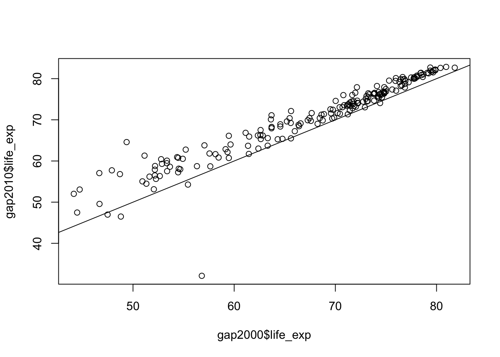

# Summarizing data

Having loaded and thoroughly explored a data set, we are ready to distill it down to concise conclusions. At its simplest, this involves calculating summary statistics like counts, means, and standard deviations. Beyond this is the fitting of models, and hypothesis testing and confidence interval calculation. R has a huge number of packages devoted to these tasks, and this is a large part of its appeal, but this is largely beyond the scope of today.

Loading the data as before, if you have not already done so:


```r
library(tidyverse)

geo <- read_csv("r-intro-2-files/geo.csv")
geo$income2017 <- factor(geo$income2017, levels=c("low","lower_mid","upper_mid","high"))

gap <- read_csv("r-intro-2-files/gap-minder.csv")
gap_geo <- left_join(gap, geo, by="name")
```


## summarize

R has a variety of functions for summarizing a vector, including: `sum`, `mean`, `min`, `max`, `median`, `sd`.


```r
mean( c(1,2,3,4) )
```

```
## [1] 2.5
```

We can use this on the Gapminder data.


```r
gap2010 <- filter(gap_geo, year == 2010)
mean(gap2010$lifeExp)
```

```
## Warning: Unknown or uninitialised column: 'lifeExp'.
```

```
## Warning in mean.default(gap2010$lifeExp): argument is not numeric or
## logical: returning NA
```

```
## [1] NA
```

(Possibly this should be a `weighted.mean`, as countries have different populations, but let's skip this detail.)

The `summarize` function in `dplyr` allows these to be applied to data frames.


```r
summarize(gap2010, mean_life_exp=mean(life_exp))
```

```
## # A tibble: 1 x 1
##   mean_life_exp
##           <dbl>
## 1            NA
```

So far unremarkable, but `summarize` comes into its own when the `group_by` "adjective" is used.


```r
summarize(group_by(gap2010, year), mean_life_exp=mean(life_exp))
```

```
## # A tibble: 1 x 2
##    year mean_life_exp
##   <int>         <dbl>
## 1  2010            NA
```


### Challenge: summarizing {.challenge}

What is the total population for each year?

Advanced: What is the total GDP for each year? For this you will first need to calculate GDP per capita times the population of each country.


## t-test

We will finish this section by demonstrating a t-test as an example of statistical tests available in R.

Has life expectancy increased from 2000 to 2010?


```r
gap2000 <- filter(gap_geo, year == 2000)
gap2010 <- filter(gap_geo, year == 2010)

t.test(gap2010$life_exp, gap2000$life_exp)
```

```
## 
## 	Welch Two Sample t-test
## 
## data:  gap2010$life_exp and gap2000$life_exp
## t = 3.0341, df = 374.98, p-value = 0.002581
## alternative hypothesis: true difference in means is not equal to 0
## 95 percent confidence interval:
##  1.023455 4.792947
## sample estimates:
## mean of x mean of y 
##  70.34005  67.43185
```

This can actually be considered a paired sample t-test. We can specify `paired=TRUE` to `t.test` to perform a paired sample t-test (check this by looking at the help page with `?t.test`). It's important to first check that both data frames are in the same order.


```r
all(gap2000$name == gap2010$name)
```

```
## [1] TRUE
```

```r
t.test(gap2010$life_exp, gap2000$life_exp, paired=TRUE)
```

```
## 
## 	Paired t-test
## 
## data:  gap2010$life_exp and gap2000$life_exp
## t = 13.371, df = 188, p-value < 2.2e-16
## alternative hypothesis: true difference in means is not equal to 0
## 95 percent confidence interval:
##  2.479153 3.337249
## sample estimates:
## mean of the differences 
##                2.908201
```

When performing a statistical test, it's good practice to visualize the data to make sure there is nothing funny going on.


```r
plot(gap2000$life_exp, gap2010$life_exp)
abline(0,1)
```




# Thinking in R

The result of a t-test is actually a value we can manipulate further. Two functions help us here. `class` gives the "public face" of a value, and `typeof` gives its underlying type, the way R thinks of it internally.


```r
class(42)
```

```
## [1] "numeric"
```

```r
typeof(42)
```

```
## [1] "double"
```


```r
result <- t.test(gap2010$life_exp, gap2000$life_exp, paired=TRUE)

class(result)
```

```
## [1] "htest"
```

```r
typeof(result)
```

```
## [1] "list"
```

```r
names(result)
```

```
## [1] "statistic"   "parameter"   "p.value"     "conf.int"    "estimate"   
## [6] "null.value"  "alternative" "method"      "data.name"
```

```r
result$p.value
```

```
## [1] 4.301261e-29
```

In R, a t-test is just another function returning just another type of data, so it can also be a building block. The value it returns is a special type of vector called a "list", but with a public face that presents itself nicely. This is a common pattern in R. Besides printing to the console nicely, this public face may alter the behaviour of generic functions such as `plot` and `summary`.

Similarly a data frame is a list of vectors that is able to present itself nicely.

## Lists

Lists are vectors that can hold anything as elements (even other lists!). It's possible to create lists with the `list` function. This becomes especially useful once you get into the programming side of R. For example writing your own function that need to return multiple values, it might do so in the form of a list.


```r
mylist <- list(hello=c("Hello","world"), numbers=c(1,2,3,4))
mylist
```

```
## $hello
## [1] "Hello" "world"
## 
## $numbers
## [1] 1 2 3 4
```

```r
class(mylist)
```

```
## [1] "list"
```

```r
typeof(mylist)
```

```
## [1] "list"
```

```r
names(mylist)
```

```
## [1] "hello"   "numbers"
```

Accessing lists can be done by name with `$` or by position with `[[ ]]`. 


```r
mylist$hello
```

```
## [1] "Hello" "world"
```

```r
mylist[[2]]
```

```
## [1] 1 2 3 4
```


## Other types not covered here

Matrices are another tabular data type. These come up when doing more mathematical tasks in R. They are also commonly used in bioinformatics, for example to represent RNA-Seq count data. A matrix, as compared to a data frame:

* contains only one type of data, usually numeric (rather than different types in different columns).
* commonly has `rownames` as well as `colnames`. (Base R data frames can have `rownames` too, but it is easier to have any sort of ID as a normal column instead.)
* has individual cells as the unit of observation (rather than rows).

Matrices can be created using `as.matrix` from a data frame, `matrix` from a single vector, or using `rbind` or `cbind` with several vectors.

You may also encounter "S4 objects", especially if you use [Bioconductor](http://bioconductor.org/) packages. The syntax for using these is different again, and uses `@` to access elements.


